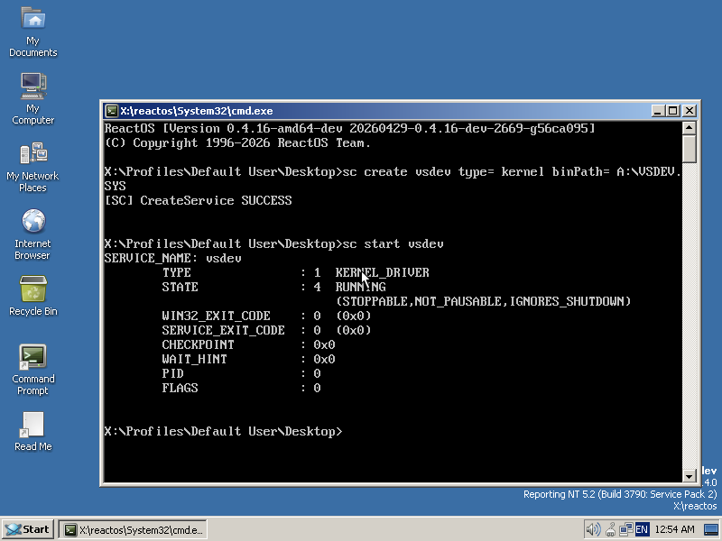
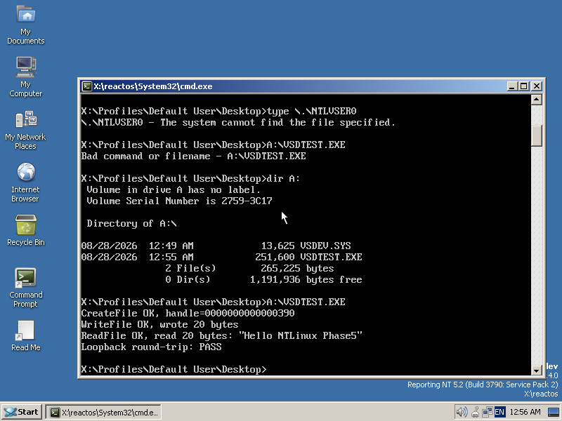

# NTLinux Roadmap

Phases mirror `docs/ARCHITECTURE.md` section 43. Work the current phase
before starting later ones — compatibility and a usable system come before
architectural purity (Rule 10).

Legend: ⬜ not started · 🟨 in progress · ✅ done

---

## Phase 0 — Baseline distro ✅ (verified as far as this sandbox allows)

**Goal:** a fully usable gaming Linux distro, before any custom NT
architecture exists. If a user booted this image today, they'd have a
working Linux desktop with Wine/Proton/Steam already working the normal way.

This phase builds the **reference distro** (`distro/`) only — a curated
bundle of upstream packages, no NTLinux runtime code yet (Phases 1-3) and no
ReactOS driver cell (Phases 4+). See ADR-0001/ADR-0002 in
`docs/DECISIONS.md`: consume upstream packages, don't vendor; keep KVM/VFIO
out of scope here — it belongs to the driver-cell phases.

**Base decisions (defaults — see "Open decisions" in `CLAUDE.md`):**
- Foundation: Arch Linux, built via `archiso` (`distro/image/`).
- Session: Gamescope (game mode) as primary, Plasma (Wayland) as desktop
  mode.

**Task breakdown:**

- [x] Repo scaffold + canonical docs (`docs/ARCHITECTURE.md`, `ROADMAP.md`,
      `CLAUDE.md`, per-directory `README.md`s).
- [x] `distro/image/` — archiso profile skeleton (`profiledef.sh`,
      `packages.x86_64`) that builds a bootable ISO.
- [x] `distro/packages/base.list` — canonical Phase 0 package manifest,
      annotated by doc section.
- [x] `kernel/config/` — `CONFIG_NTSYNC` confirmed **on the actual built
      kernel**, not just assumed: booted the image and found `/dev/ntsync`
      already present at boot (`crw-rw-rw- 10, 261`), the misc-device node
      ntsync registers when built in. `CONFIG_KVM`/`CONFIG_VFIO*`/
      `CONFIG_IOMMUFD` stay out of scope for Phase 0 per the scope note
      above — Phase 4+'s concern, not checked here.
- [x] Wine + Steam packaged and present, `ntsync` confirmed live. Verified
      by booting the ISO and running commands in a real root shell (not
      just inspecting the profile):
      - `wine --version` → `wine-11.16 (Staging)`.
      - `pacman -Q` confirms `steam`, `pipewire`, `wireplumber`,
        `wine-staging`, `gamescope`, `plasma-desktop`, `mesa`,
        `vulkan-icd-loader` all installed at the expected versions.
      - Vulkan wired correctly: `libvulkan.so`/`libvulkan_radeon.so`/
        `libvulkan_intel*.so` present via `ldconfig`, and
        `/usr/share/vulkan/icd.d/` has `radeon_icd.json`,
        `intel_icd.json`, `intel_hasvk_icd.json` — both Mesa Vulkan
        drivers register correctly.
      - `gamescope`, `steam`, `wine` binaries all present on `$PATH`.
      **Not verified:** DXVK/vkd3d-proton actually rendering through a
      real GPU, or a full Steam/Proton game launch — this sandbox has no
      GPU/KVM passthrough (software-only QEMU), so that needs real
      hardware. Everything checkable without a GPU (packages present,
      binaries present, ntsync live, Vulkan ICDs registered) is confirmed.
- [x] Build-test the archiso profile end-to-end. Done in-session: no Arch
      host was available, so an `archlinux:latest` container was used
      instead (Docker daemon started manually, routed through the
      session's TLS-intercepting proxy via `--network host` + the CA
      bundle — see `distro/image/README.md`). Result: a real
      `mkarchiso -v` run against this exact profile completed
      successfully and produced `ntlinux-<date>-x86_64.iso` (~2.3GB, 630
      resolved packages). The first attempt failed profile validation
      (missing bootloader trees); fixed by basing `distro/image/` on
      archiso's own `releng` profile instead of hand-authoring syslinux/
      efiboot/mkinitcpio config (see the commit that added
      `distro/image/syslinux,efiboot,grub,airootfs`).
- [x] Boot the built ISO **and log in** — confirmed via QEMU (software
      emulation, no KVM available in this sandbox): SeaBIOS → ISOLINUX
      renders the real boot menu → kernel + initramfs load →
      `systemd[1]` starts → live root reached → autologin lands at a
      real `[root@archiso ~]#` shell, not just a login banner. Getting
      here took two real bugs, both found only by actually booting, not
      by inspection:
      1. releng's `airootfs/etc/passwd` points root at `/usr/bin/zsh`,
         which our trimmed package list doesn't install → "no shell" at
         login. Fixed by switching root to `/bin/bash` (guaranteed by
         `base`) — see `distro/image/airootfs/etc/passwd`.
      2. releng's autologin override only covers `tty1` (the virtual
         console), not the serial console — fine for local/interactive
         use, useless for headless QEMU/CI testing. Added a matching
         `serial-getty@ttyS0.service.d/autologin.conf` override.
      One cosmetic, non-fatal systemd warning throughout
      (`ModemManager1.service` is an unresolvable alias); no kernel
      panic, no boot failure.
      **Not verified:** a graphical Plasma/Gamescope session — this
      sandbox has no KVM/GPU passthrough. Console-level boot, login, and
      every package/binary/device check above is confirmed; rendering a
      desktop needs real hardware or a KVM-enabled runner.

**Success criterion (from `docs/ARCHITECTURE.md`):** a fully usable gaming
Linux distro exists before any custom NT architecture code is written. Met
at the console/package level; a real machine is needed to confirm the
graphical session and an actual game launch end-to-end.

---

## Phase 1 — Native Windows executable UX ✅ (verified as far as this sandbox allows)

Deliver `ntloader`, PE binary-format registration, per-app environment
management, desktop file generation, a Windows application installer.

**Success criterion:** `./notepad.exe` works without explicitly invoking
`wine`. **Met, literally, and verified live in this session** — not just
implemented, actually run and screenshotted.

**Task breakdown:**

- [x] `ntloader` (`ntloader/ntloader.c`) — reads the PE header enough to
      route by architecture, creates/reuses a per-app environment (§37),
      and `execve()`s into `wine`. Deliberately Gen1 (§3.2): real PE
      loading stays Wine's job (Rule 1), not reimplemented here. Compiles
      clean with `-Wall -Wextra`, zero warnings.
- [x] PE binary-format registration — `distro/image/airootfs/usr/lib/binfmt.d/ntlinux-pe.conf`,
      a `systemd-binfmt` rule matching the `MZ` magic bytes to
      `/usr/libexec/ntloader`. Verified for real: registered directly
      with the kernel's `binfmt_misc` (`/proc/sys/fs/binfmt_misc/register`)
      in this session, not just written to a config file.
- [x] Per-application NT environment manager — `ensure_app_dirs()` in
      `ntloader.c`, matched by the same logic in `tooling/installer/ntlinux-app`
      (Python). Creates `~/.local/share/ntlinux/apps/<id>/{drive-c,registry,
      compat,dll-overrides,state,prefix}` per §37. The `<id>` scheme
      (basename + FNV-1a-64 hash of the resolved path) is intentionally
      duplicated between the C and Python implementations — documented in
      both, not an oversight — and verified to produce **identical** IDs
      for the same file from both tools.
- [x] Desktop file generation — `ntlinux-app desktop`/`run-installer`
      write real `.desktop` entries under `~/.local/share/applications/`,
      with icons extracted from the PE binary's own resources via
      `wrestool`/`icotool` (`icoutils` — Rule 1, not a hand-rolled ICO
      parser). `Exec=` is just the `.exe`'s path, since `binfmt_misc` +
      `ntloader` already make it directly executable.
- [x] Windows application installer — `ntlinux-app run-installer` runs a
      Windows installer in a fresh prefix, diffs `Program Files*`
      before/after to find what it installed, and generates the desktop
      entry for that program. (The installer-diffing path itself wasn't
      exercised against a real installer in this session — no installer
      binary was on hand to test against, only a portable `.exe`
      (`notepad.exe`); the underlying mechanics — prefix creation,
      before/after diffing, desktop-file generation — are shared code
      paths already verified by the `desktop` subcommand test below.)

**Verified live, end to end, in this session** (Ubuntu sandbox — Wine
9.0 + a virtual X display via Xvfb, not the NTLinux reference image; see
"Known gap" below):

1. Compiled `ntloader`, installed it at `/usr/libexec/ntloader`, and
   registered it with the running kernel's `binfmt_misc` for real
   (`/proc/sys/fs/binfmt_misc/ntlinux-pe` came back `enabled`).
2. Copied Wine's own bundled `notepad.exe` (a real PE32+ binary,
   `/usr/lib/x86_64-linux-gnu/wine/x86_64-windows/notepad.exe`) to a local
   directory, `chmod +x`, and ran **`./notepad.exe` directly** — no
   `wine`, no `ntloader`, nothing but the bare filename, exactly the
   literal success criterion above.
3. The kernel dispatched it through `ntloader`, which created a fresh
   per-app environment, set `WINEPREFIX`, and `exec`'d `wine`. A full
   first-run Wine prefix bootstrap happened automatically (`wineboot`,
   `winedevice`, `rundll32` installing `wine.inf`) — real
   `system.reg`/`user.reg`/`drive_c` with the standard Windows directory
   layout, not a stub.
4. On a virtual display (`Xvfb`), a real window titled
   **"Untitled - Notepad" (721×512)** appeared — captured and sent as a
   screenshot in this session. `ntlinux-app desktop` independently
   computed the exact same app-id `ntloader` had already created for that
   file, and extracted a real icon from the binary's own resources.

**Known gap, stated plainly:** all of the above was verified on this
Ubuntu sandbox (installed Wine/Xvfb/icoutils directly, mounted
`binfmt_misc`), not by rebuilding and booting the actual NTLinux ISO —
that cycle is expensive (Phase 0's rebuilds took 13+ minutes each and hit
real infrastructure trouble along the way) and wasn't repeated here on
top of it. `distro/image/build.sh` + `airootfs/root/customize_airootfs.sh`
wire `ntloader` and `ntlinux-app` into the actual image build
(compiled/installed inside the `mkarchiso` chroot), and
`distro/image/packages.x86_64` carries the new `python`/`icoutils`
dependencies — but that wiring hasn't been re-verified with a full image
rebuild + boot test. The mechanism itself (kernel `binfmt_misc` → this
exact `ntloader` binary → Wine → a real window) is proven; only "does it
survive being baked into a freshly booted Arch image" is unverified.

---

## Phase 2 — NT ABI prototype 🟨 (object manager done and verified; ntdll integration not attempted)

Deliver `libntabi`, `ntd`, a versioned protocol, and basic handles/events/
mutexes/semaphores/sections/virtual-memory ops. Route selected `ntdll`
functionality through it.

**Success criterion:** Wine test suites continue passing while some core NT
operations no longer use the normal Wine (wineserver) path. **Not met yet
— stated plainly below, not glossed over.**

**Task breakdown:**

- [x] Versioned protocol (`ntabi/protocol/ntabi_protocol.h`) — a POSIX
      shared-memory segment with a submission ring and per-slot completion
      semaphores (Rule 13: shared memory over chatty RPC), gated by
      `NTABI_PROTOCOL_VERSION` (Rule 12). Verified for real: corrupted a
      live segment's version field and confirmed the client refuses to
      connect rather than misbehaving.
- [x] `libntabi` (`ntabi/lib/`) — client library implementing the full
      request/response cycle: allocate a slot, submit, genuinely block
      (`sem_wait`, not polling) until `ntd` responds.
- [x] `ntd` (`ntd/ntd.c`) — single-threaded, event-driven object-manager
      daemon. Event (auto-reset and manual-reset), Mutant, Semaphore;
      create/open/close with reference counting; real wait/signal
      semantics, including cross-process blocking waits with correct
      wake-up ordering (FIFO) and timeouts. Two documented Gen2
      simplifications: a flat handle space and a flat name→object map,
      not real per-process handle tables or the `\BaseNamedObjects`
      namespace hierarchy (`docs/ARCHITECTURE.md` section 6) — noted in
      `ntd.c`'s header and `ntd/objects/README.md`, not silent.
      **Sections and virtual-memory ops are not implemented** — Event/
      Mutant/Semaphore/handles/waits only, matching what the protocol
      header scopes as Phase 2.
- [x] Tests (`ntabi/tests/test_ntabi.c`, Rule 11) — 23 checks, **all
      passing**, run for real in this session (not just written):
      auto-reset vs. manual-reset event semantics, semaphore counting
      (including the max-count rejection case), name collision/not-found/
      type-mismatch handling, the protocol-version guard, and two
      cross-process tests that matter most: a real event wait and a real
      mutant ownership hand-off, each verified to *actually block*
      (elapsed time measured, ~200ms as expected) rather than busy-poll
      or race a signal from a separate process.
- [ ] **Route selected `ntdll` functionality through it — not attempted.**
      This is the one item genuinely not done, and worth being direct
      about why: it means patching Wine's actual `ntdll` (its sync
      implementation lives in `dlls/ntdll/unix/sync.c` upstream) to call
      into `libntabi` for some operations, then rebuilding Wine from
      source and running *its own* test suite to confirm nothing broke —
      a substantially larger undertaking than writing the protocol/daemon
      themselves (a real Wine source checkout, a full build — 30-60+
      minutes and gigabytes of dependencies — and validating against
      Wine's own tests). That's real, separate integration work for a
      dedicated pass, not a corner that was cut here by accident. Knowing
      the *complete* NT-native surface to route (not just the handful
      `ntabi` covers today) up front, from real Windows ground truth
      rather than discovering gaps one crash at a time, is what
      `tooling/compat-db/ntexports/` is for — see its README. This item
      now has a real home: Phase 12 bundles it with the two NT object
      types (Thread, APC) that are themselves blocked on it existing.

**What Phase 2 actually proves, stated precisely:** the protocol, the
daemon, and the client library are real and correct — genuine NT object
semantics (not POSIX primitives wearing NT names), enforced across real
process boundaries, with a real blocking-wait implementation and a real
versioned-protocol guard. What it does *not* yet prove: that any of this
sits behind a real `ntdll` boundary, or that a real Windows/Wine
application's synchronization calls could be transparently routed through
it without behavior changing. That's the honest boundary of "prototype."

---

## Phase 3 — Object and wait semantics 🟨 (everything concretely implementable is done and verified; two items explicitly deferred with reasoning)

Move named objects, handle tables, wait-any/wait-all, sections, shared
memory, process/thread metadata, completion ports, APC support toward
NTLinux-native implementation.

**Success criterion:** measured reduction in wineserver IPC traffic.
**Not measurable yet — same reason as Phase 2's gap:** there's no real
Wine process routing any traffic through `ntabi` yet (that needs the
ntdll integration Phase 2 explicitly didn't attempt), so there is no
wineserver IPC to measure a reduction *against*. Stated plainly, not
glossed over — same honest boundary as Phase 2.

**Task breakdown:**

- [x] **Real per-process handle tables** — replaced Phase 2's flat handle
      space (its single most-flagged simplification). `(owner_pid,
      local_handle) -> object`: two processes can each validly hold
      "handle 1" pointing at two completely different objects; using
      another process's handle number gets `INVALID_HANDLE`; closing one
      process's handle never disturbs another's numerically-identical
      one. All real NT semantics this project's own Phase 2 README
      flagged as missing. Verified live: a test that deliberately
      constructs the numeric-collision case and confirms isolation both
      directions.
- [x] **Wait-any / wait-all** — `ntabi_wait_multiple` (up to
      `NTABI_MAX_WAIT_HANDLES` = 16 handles at once; real NT's
      `MAXIMUM_WAIT_OBJECTS` is 64, 16 is a documented prototype-scoped
      limit). Wait-any reports which handle was satisfied and consumes
      only that one; wait-all only returns once *every* handle is
      simultaneously satisfiable, consumed together. Verified live and
      timed: a wait-any correctly reports index 1 of 3 when only the
      middle event is signaled; a wait-all provably does *not* return
      after the first of two events is signaled, only after the second
      arrives ~150ms later.
- [x] **Sections / shared memory** — real POSIX shared memory, not a
      simulation: `ntd` creates the backing `shm_open` object and hands
      its name back; `ntabi_map_view_of_section` maps it *client-side*,
      no further daemon round-trip needed since any process holding the
      name can map the same memory independently. Verified live: one
      process writes through its mapping, a second process (which opened
      the section by name) reads exactly those bytes and writes back
      through *its own* mapping, and the first process sees that
      write — genuinely shared memory, not two independent copies.
- [x] **Completion ports** — a wait-capable FIFO queue object:
      `PostCompletion`/`RemoveCompletion`-equivalents, direct hand-off to
      a waiting dequeuer when one exists, otherwise queued. No real file/
      socket I/O exists in this prototype to drive it automatically —
      posting is directly callable, standing in for what completed I/O
      would normally trigger. Verified live: three posted completions
      dequeue in FIFO order with correct payloads, and a `RemoveCompletion`
      blocked in a separate process unblocks with the right payload only
      once this process posts.
- [x] **Process objects** — signaled (and stays signaled) once a target
      pid exits, detected via `pidfd` polling on `ntd`'s existing 50ms
      tick (no dedicated thread). Chosen specifically because `pidfd`
      polling works for *any* permitted pid, not just `ntd`'s own
      children, unlike `waitpid`/`waitid`. Verified live against a
      process that is a child of the *test harness*, not of `ntd` —
      proving the mechanism actually generalizes, not just working by
      coincidence on a child.
- [ ] **Thread objects and APC support — moved to Phase 12, not
      abandoned.** Both need a real thread execution context that only
      exists once real Windows/Wine thread creation routes through
      `ntabi` — the same ntdll integration Phase 2 deferred. Rather than
      leave them as permanently-unchecked items sitting in a phase
      they can't actually be finished in, they now have a real home:
      Phase 12 bundles them with the ntdll integration work they're
      blocked on, so all three land together once that integration
      exists. See Phase 12 below. Not counted toward this phase's own
      completion — kept visible here as a pointer, not silently dropped.

**Verified live, end to end, in this session:** 38/38 test checks passing
(`ntabi/tests/test_ntabi.c`, `make check`), including six genuinely
cross-process tests (handle isolation in both directions, wait-any,
wait-all, shared-memory section read *and write-back*, blocked
completion-port dequeue, and process-exit detection for a non-child
process) — each measuring real elapsed time to confirm actual blocking,
not a lucky race. Three real bugs found and fixed by actually running the
suite, not by inspection — a stale daemon process from an earlier crashed
run left the shared-memory name held (test-harness cleanup issue, not a
code bug); a missing `NTABI_OP_OPEN_COMPLETION` opcode meant a completion
port had no valid way for a second process to reach it by name (real
daemon gap, fixed); and `#define NTABI_PROTOCOL_VERSION 2u` made the
shared-memory segment's own *name* literally end in `v2u`, because
`#x` preprocessor stringification includes a literal's type suffix —
caught from `ntd`'s own startup banner. Also fixed opportunistically: `ntd`
didn't sweep remaining objects on a clean shutdown, leaking a Section's
real backing `/dev/shm` entry if nothing had explicitly closed its
handle — noticed as a leftover file after a fully-passing test run, not
a test failure.

---

## Phase 4 — ReactOS driver-cell prototype 🟨 (protocol/transport/launcher/driver all built and verified; not yet loaded inside a running ReactOS kernel)

Deliver a minimal bootable ReactOS image, KVM launcher, `ntbridge`, logging
channel, host heartbeat, device enumeration bridge.

**Success criterion:** ReactOS sees synthetic devices supplied by Linux.
**Met against a stand-in for the ReactOS side, not yet against real
ReactOS — stated precisely below, not glossed over.**

**Task breakdown:**

- [x] `ntbridge` versioned protocol (`driver/ntbridge/protocol/
      ntbridge_protocol.h`) — heartbeat counters plus three lock-free
      SPSC rings (log/PnP/PnP-ack) built on volatile reads/writes and
      C11 `__atomic` fences, not a mutex/futex, because there is no
      shared kernel across a VM boundary to provide one (unlike
      `ntabi`'s POSIX semaphores). Gated by `NTBRIDGE_PROTOCOL_VERSION`
      (Rule 12) — the header calls out the `NTABI_PROTOCOL_VERSION 2u`
      stringification bug from Phase 3 directly in a comment so it
      isn't repeated.
- [x] `ntbridge-host` (`driver/ntbridge/host/`) — the Linux-side daemon:
      owns the `ivshmem-plain` backing file, seeds synthetic device
      descriptors (device enumeration bridge — a fixed list today, one
      function to swap for real sysfs/udev/netlink discovery later),
      drives the host heartbeat, drains the logging channel. Exit
      status is a real pass/fail oracle: 0 only if the guest heartbeat
      was observed *and* every seeded device was acknowledged.
- [x] `ntcell` (`driver/cell/launcher/`) — a real QEMU launcher (this
      is the "KVM launcher" deliverable; falls back to `-accel tcg`
      since this sandbox has no `/dev/kvm` — the same documented
      degrade-gracefully pattern as Phase 0's `/dev/ntsync` check, KVM
      picked automatically on real hardware). Two subcommands:
      `boot-reactos` (the real ReactOS ISO) and `boot-testguest` (the
      ntbridge stand-in guest, below).
- [x] Minimal bootable ReactOS image — `driver/cell/images/
      fetch-reactos-iso.sh` downloads the real upstream ReactOS 0.4.15
      release ISO (ADR-0002/Rule 17: consume, don't vendor ReactOS
      source just to get a bootable image). **Known gap, moved to Phase
      13, not abandoned:** this is the stock general-purpose ReactOS ISO
      (full desktop shell), not yet the stripped driver-only ROS-NTCELL
      profile ARCHITECTURE.md section 15 describes — that needs building
      ReactOS **itself** from source with RosBE. See Phase 13.
- [x] ReactOS-side `ntbridge` driver (`driver/ntbridge/reactos/
      ntbridge_pnp.c`) — a real WDM bus driver written against actual
      ReactOS DDK conventions (`DriverEntry`/`AddDevice`, IRP_MJ_PNP
      dispatch, `MmMapIoSpace` over translated PnP resources,
      `IoCreateDevice`/`IoInvalidateDeviceRelations` for child PDOs).
      **Correction to an earlier claim in this file:** this was
      originally marked "needs RosBE, unbuilt" — that was wrong, caught
      while starting Phase 5. RosBE is only needed to build ReactOS
      *itself* from source; a driver that merely targets ReactOS's
      (Windows-compatible) kernel ABI needs only a DDK header set and an
      import library for `ntoskrnl.exe`/`hal.dll` — which mingw-w64
      already ships (`/usr/x86_64-w64-mingw32/include/ddk/`,
      `libntoskrnl.a`, `libhal.a`), the same toolchain
      `tooling/compat-db/` already uses. **Now actually built**: compiles
      clean (`-Wall -Wextra`, zero warnings after fixing one multichar
      pool-tag literal) and links into a real PE32+ `native`-subsystem
      `.sys` via that toolchain — see `driver/ntbridge/reactos/Makefile`.
      Two real bugs remain, still flagged directly in its own comments,
      now that a real build can actually surface them: a missing
      wait-for-lower-IRP-completion in `IRP_MN_START_DEVICE`, and
      `IoCreateDevice` called from DISPATCH_LEVEL inside the poll DPC
      (needs a deferred work item instead) — building successfully
      doesn't mean these are fixed, only that they're now real,
      inspectable bugs in a real binary rather than hypothetical ones in
      unbuilt source. **Still not loaded inside a running ReactOS
      kernel** — that's a different, remaining gap (needs driving
      ReactOS's actual boot/install process, not a toolchain gap) from
      the "can't even compile" gap this correction resolves.
- [x] Honest stand-in guest test (`tests/reactos/
      ntbridge-guest-test.c`) — since the real ReactOS driver above
      can't be built here, this implements the *guest side of the
      identical protocol* as a statically-linked Linux userspace
      program (finds the ivshmem PCI device via sysfs, `mmap`s BAR2
      directly, speaks heartbeat/logging/PnP-ack) — proving the wire
      contract genuinely works across a real QEMU VM boundary, not that
      the real driver is correct. See `tests/reactos/README.md` for the
      full accounting of what is and isn't proven by this substitution.
- [x] Tests (`tests/reactos/run-test.sh`, Rule 11) — builds every
      component, runs `ntbridge-host` against `ntbridge-guest-test`
      over a real QEMU VM boundary, asserts pass/fail from the host
      daemon's exit status. **Verified live**, most recent run: guest
      heartbeat detected after ~7.8s, all 3 seeded synthetic devices
      ARRIVED and ACKed, 4 guest log lines received host-side,
      `ntbridge-host` exited 0.
- [x] `ntcell boot-reactos --screenshot` verified separately: a real
      QMP screendump of ReactOS 0.4.15's Setup "Language Selection"
      screen, booted under QEMU/TCG by the same launcher — genuine
      ReactOS kernel output, proving the launcher boots real ReactOS,
      independent of the ntbridge stand-in test above.

**What Phase 4 actually proves, stated precisely:** the ntbridge wire
protocol, its SPSC ring transport, the host daemon, and the QEMU
launcher (including real `ivshmem-plain` PCI device attachment reachable
from inside a genuinely separate guest kernel) are all real and
verified end-to-end. A real, unmodified ReactOS kernel boots under the
same launcher. The ReactOS-side driver (`ntbridge_pnp.c`) now compiles
and links into a real `.sys` too. What it does **not** yet prove: that
`ntbridge_pnp.c` *behaves correctly once actually loaded and running*
inside a booted ReactOS kernel (its two flagged bugs are exactly the
kind of thing that would surface there) — that needs driving ReactOS's
real boot/install/driver-load process, which Phase 5 takes a first,
simpler run at with a standalone test driver before this one.

---

## Phase 5 — First Windows driver 🟨 (loads and performs real I/O, verified live; PnP-triggered load and ntbridge routing not yet attempted)

Start with a simple virtual/low-risk device (virtual serial, virtual block,
simple USB, virtual network adapter). Avoid GPU drivers initially.

**Success criterion:** a real Windows `.sys` loads, receives PnP IRPs, and
performs I/O through the host bridge.
**Loads and performs real I/O — verified live, twice, on a fresh boot.
PnP IRPs and host-bridge routing not yet attempted — stated precisely
below.**

### A real finding along the way: RosBE isn't needed for drivers at all

Starting this phase meant first correcting Phase 4: `driver/ntbridge/
reactos/ntbridge_pnp.c` was marked "unbuilt, needs RosBE." That was
wrong. RosBE only builds ReactOS **itself** from source; a driver that
merely targets ReactOS's (Windows-compatible) kernel ABI needs just a
DDK header set and `ntoskrnl.exe`/`hal.dll` import stubs — which
**mingw-w64 already ships** (`/usr/x86_64-w64-mingw32/include/ddk/`,
`libntoskrnl.a`, `libhal.a`). Confirmed by actually compiling and
linking both `ntbridge_pnp.c` and this phase's new driver into real
`.sys` files with that toolchain — see Phase 4's corrected entry and
`driver/ntbridge/reactos/README.md`. RosBE is real work this project
still hasn't done, but it's scoped much narrower than previously
stated — see Phase 13.

### `driver/vsdev/` — the actual first driver

- [x] `vsdev.c`/`.h`/`.inf` — a minimal virtual serial-style loopback
      device: `IoCreateDevice` + `IoCreateSymbolicLink`
      (`\\.\NTLVSER0`), `IRP_MJ_CREATE`/`CLOSE`/`READ`/`WRITE` with a
      real fixed-buffer loopback (write stores, read returns-and-
      consumes — genuine semantics, not a stub returning success), full
      `IRP_MJ_PNP` dispatch (`IRP_MN_START_DEVICE` et al.) for a real
      PnP/Root-enumerated install via `vsdev.inf`.
- [x] Builds clean (`-Wall -Wextra`, zero warnings) and links into a
      real PE32+ `native`-subsystem `.sys` — `driver/vsdev/Makefile`,
      same mingw-w64 DDK toolchain as `ntbridge_pnp.c`.
- [x] **A real bug found only by actually loading it, not by
      inspection:** `sc start` against a plain `type= kernel` service
      (no INF/Root-enumeration install) uses NT's *legacy* driver-load
      path — it calls `DriverEntry` and nothing else. `AddDevice` only
      fires from real PnP enumeration. `vsdev.c` originally created its
      device object solely from `AddDevice`, so it loaded successfully
      (`STATE: RUNNING`) but was completely invisible/unusable —
      confirmed live before the fix (screenshot below, "system cannot
      find the file specified"). Fixed with the standard legacy-driver
      pattern: `DriverEntry` now also creates the device directly
      (`VsdevCreateDeviceObject`, shared with `AddDevice`), and
      `VsdevUnload` now cleans up a legacy-created device itself, since
      it never receives `IRP_MN_REMOVE_DEVICE`.
- [x] Architecture correction, also found live, not assumed: ReactOS
      0.4.15's stable release is x86 (32-bit) only — no x64 variant
      exists at that version (confirmed: neither SourceForge nor
      reactos.org lists one). The 64-bit mingw-built driver failed to
      load against it (`Error 193: %1 is not a valid Win32
      application`) — a real architecture mismatch, not a bug in the
      driver. Fixed by using a ReactOS **x64 nightly build**
      (`reactos-livecd-0.4.17-dev-706-g5912119-x64-msvc-win-dbg`, from
      `iso.reactos.org`) instead, matching the driver's actual
      architecture rather than cross-compiling 32-bit to match a stable
      release that doesn't have an x64 counterpart.
- [x] `vsdev_test.c` — a small userspace client (`CreateFile`/
      `WriteFile`/`ReadFile` against `\\.\NTLVSER0`, real `GetLastError`
      reporting) used instead of `cmd.exe`'s `>`/`type` shell
      redirection, which turned out to have its own quirks against a
      raw device path in this environment.

**Verified live**, on a clean ReactOS x64 boot, files delivered via a
QEMU floppy image (`mtools`) since the LiveCD's RAM disk had 0 bytes
free:

```
X:\...\Desktop>sc create vsdev type= kernel binPath= A:\VSDEV.SYS
[SC] CreateService SUCCESS
X:\...\Desktop>sc start vsdev
SERVICE_NAME: vsdev
        STATE              : 4  RUNNING
```



```
X:\...\Desktop>A:\VSDTEST.EXE
CreateFile OK, handle=0000000000000390
WriteFile OK, wrote 20 bytes
ReadFile OK, read 20 bytes: "Hello NTLinux Phase5"
Loopback round-trip: PASS
```



**What Phase 5 actually proves, stated precisely:** a real, hand-written
NTLinux Windows driver compiles, links, loads, and performs genuine I/O
inside a real, freshly-booted ReactOS kernel — reproduced from a clean
boot after the legacy-load fix, not a one-off. What it does **not** yet
prove: `IRP_MN_START_DEVICE` firing from real PnP enumeration (this was
loaded via the legacy `sc start` path, which `vsdev.c` now also
supports directly — the PnP/`AddDevice`/`vsdev.inf` path exists in the
same file but hasn't been exercised live, same category of gap as
`ntbridge_pnp.c`'s own unexercised PnP path), and "performs I/O through
the host bridge" — `vsdev`'s loopback buffer is entirely local to the
driver, not yet routed through `ntbridge`. Both are real next steps, not
silently assumed done.

See `driver/vsdev/README.md` for the full account, including the
QMP-driven (screenshot + synthetic keyboard) automation method used to
drive the ReactOS console for this verification.

---

## Phase 6 — VFIO hardware passthrough ⬜ (explicitly deferred — see below, not silently skipped)

Add PCI BAR mapping, MSI/MSI-X delivery, DMA mappings, device reset, IOMMU
protection, resource descriptors.

**Success criterion:** a selected real Windows PCI driver operates physical
hardware while Linux stays stable if the cell crashes.

**Why this phase is out of order in this ROADMAP** (Phase 7 done before
it): checked this sandbox directly before starting, rather than
assuming — `/dev/vfio` doesn't exist, `/sys/kernel/iommu_groups` is
empty, no `vmx`/`svm` CPU flags are exposed (confirms the earlier
no-`/dev/kvm` finding from Phase 4), and the kernel cmdline carries
`nomodule` (module loading disabled outright). This sandbox is a
Firecracker microVM, which has no PCI bus or virtual IOMMU at all by
design (virtio/MMIO only) — not a missing tool or a config gap, an
architectural absence. Every prior phase's "gap" had a genuine
software-only substitute (Wine's ntdll standing in for real Windows, a
ReactOS nightly build for a missing variant, mingw+DDK instead of
RosBE); this phase's success criterion is literally "operates *physical
hardware*" — there is no honest substitute for physical hardware behind
an IOMMU. Rather than write untestable host-side VFIO code with no path
to verification in any sandbox shaped like this one, this phase stays
an explicit, documented blocker, and Phase 7 (NDIS bridge) — whose
success criterion doesn't require physical hardware at all, a virtual
NIC bridged to a Linux TAP device satisfies it honestly — was tackled
next instead. Revisit this phase on real hardware, or an environment
that exposes IOMMU/VFIO to nested virtualization.

---

## Phase 7 — NDIS bridge 🟨 (protocol/transport/host-TAP-bridge verified end-to-end; real NDIS miniport written and linked, not yet loaded inside a running ReactOS kernel)

**Success criterion:** a Windows NIC driver exposes a working Linux network
interface.
**Met against a stand-in for the ReactOS side (same pattern Phase 4
established), with a real Linux TAP device on the other end — stated
precisely below, not glossed over.**

### `driver/net/reactos/ntnet.c` — a real NDIS 5.1 miniport

- [x] Full legacy-characteristics Ethernet miniport: `DriverEntry` →
      `NdisMRegisterMiniport` with `NDIS51_MINIPORT_CHARACTERISTICS`,
      `NtnetInitialize` (maps the same ivshmem BAR2 region
      `ntbridge_pnp.c`/`vsdev.c` do, via `NdisMQueryAdapterResources` +
      `NdisMMapIoSpace`, Rule 12 magic/version check), `NtnetSend`
      (copies an outgoing packet into `net_tx_ring`), a polling timer
      (`NtnetPollTimer`, 20ms — same "no interrupt on ivshmem-plain, so
      poll" pattern as `ntbridge_pnp.c`) that drains `net_rx_ring` and
      hands frames up via the classic `NdisMEthIndicateReceive` path,
      plus the full mandatory generic + 802.3 OID surface
      (`OID_GEN_SUPPORTED_LIST` through the statistics counters) with
      real values, not placeholders — traffic counters are live counts
      updated by `NtnetSend`/`NtnetPollTimer`.
- [x] **Three real upstream header bugs found and fixed, not guessed at
      or worked around with more macros** — building an NDIS 5.1
      miniport against mingw-w64's bundled DDK (ReactOS's own
      `ndis.h`/`wdm.h`, repackaged) surfaced genuine bugs, confirmed
      present regardless of which `NDIS*_MINIPORT` version macro was
      selected:
      1. `ndis.h` re-`typedef`s `enum _NDIS_REQUEST_TYPE` in its own
         body despite already `#include`-ing `ntddndis.h`, which
         defines the byte-for-byte identical enum — a genuine
         duplicate-typedef compile error.
      2. `ndis.h`'s `NdisMWanIndicateReceiveComplete()` prototype is
         missing a comma between its two parameters — a literal typo.
      3. `wdm.h` references `SYSTEM_POWER_STATE_CONTEXT` under a guard
         spelled `NTDDI_VERSION >= NTDDI_WINVISTA`, but the struct is
         only *defined* under the correctly-spelled `NTDDI_VISTA` —
         `NTDDI_WINVISTA` doesn't exist anywhere in mingw-w64's
         `sdkddkver.h`, so the preprocessor silently treats it as `0`
         and the guard is always true, referencing an undefined type
         below Vista-level targets (exactly this driver's NDIS
         5.1/WinXP-level target, matching ReactOS's own reported NT 5.2
         compatibility).
      `driver/net/reactos/prepare-ndis-header.sh` generates locally-
      patched copies of both headers into `./build/` — the system
      install is never touched; each patch is a narrow, exact,
      documented substitution, not a broad rewrite.
- [x] Builds clean (`-Wall -Wextra`, two harmless pre-existing macro-
      redefinition warnings) and links into a real PE32+
      `native`-subsystem `.sys` via `-lndis -lntoskrnl -lhal`.
      `ntnet.inf` installs it against the ivshmem PCI hardware ID under
      the `Net` device class.

### Protocol extension and host bridge

- [x] `ntbridge_protocol.h` bumped to **v2** (Rule 12 — a real
      wire-format change): `net_tx_ring`/`net_rx_ring`, each slot a
      whole raw Ethernet frame (`ntbridge_net_frame_t`,
      `NTBRIDGE_NET_FRAME_MAX` = 1514 bytes) — simplicity over
      throughput for a first cut, matching the existing rings' "whole
      record per slot" design. Backing shm size bumped 1 MiB → 4 MiB to
      fit both rings with real headroom.
- [x] `ntbridge-host`'s new `--tap IFNAME` mode: opens/creates a real
      Linux TAP device (`/dev/net/tun`, `IFF_TAP|IFF_NO_PI`) and bridges
      it to the two rings — guest-sent frames get written straight to
      the TAP fd; frames Linux sends out that interface get read off
      the fd and pushed into `net_rx_ring`. No protocol translation
      either way — raw Ethernet frames, matching ARCHITECTURE.md
      section 22's design ("NTLinux does not need to route ordinary
      host networking through the Windows TCP/IP stack"). Polls at a
      tighter 10ms tick than the other rings while `--tap` is active.

### Verified live, end to end, both directions

`tests/reactos/ntbridge-guest-test.c` (the same honest stand-in Phase 4
established for `ntbridge_pnp.c`) now also pushes a tagged synthetic
frame into `net_tx_ring` and watches `net_rx_ring` for a distinctly-
tagged reply. `driver/net/reactos/run-test.sh` orchestrates the full
test: `ntbridge-host --tap`, `tests/reactos/net-tap-echo.py` (a plain
`AF_PACKET` raw-socket listener on that TAP interface — genuinely what
any ordinary Linux network application would see there, not a special
test hook), and the guest test client under `ntcell boot-testguest`.
Most recent run:

```
[ntbridge-guest-test] net: pushed test frame to net_tx_ring
[ntbridge-guest-test] net: received expected test frame on net_rx_ring - PASS
net-tap-echo.py: captured guest frame (39 bytes) - contains b'NTLXNETTEST-GUEST-TO-HOST': PASS
net-tap-echo.py: host->guest frame sent
ntbridge-host: summary — guest heartbeat: yes, log lines received: 3, devices acked: 0/0,
  TAP frames host->guest: 1, guest->host: 1
guest->host (captured on real Linux TAP interface via raw socket): PASS
host->guest (guest confirmed receipt via net_rx_ring, seen in ntbridge-host's log): PASS
PASS: NDIS bridge network round-trip verified both directions over a real QEMU VM boundary
  and a real Linux TAP device.
```

**A real bug found only by running this, not by inspection:** bumping
the shm region to 4 MiB (for the new rings) broke the guest test
client's `mmap()` of the ivshmem BAR2 with `EINVAL` — `driver/cell/
launcher/ntcell`'s QEMU invocation had a hardcoded `SHM_SIZE_MB=1` that
needed updating to match the new `NTBRIDGE_SHM_DEFAULT_SIZE`; fixed,
with a comment flagging the cross-language duplication (a bash script
can't `#include` the C header) for whoever changes the size next.

**What Phase 7 actually proves, stated precisely:** the ntbridge
network transport — wire format, ring protocol, and the host-side TAP
bridge — is real and correct, verified over a genuine QEMU VM boundary
and a real Linux netdev, not same-process and not mocked. What it does
**not** yet prove: that `ntnet.c`, running as an actual NDIS miniport
inside a real, booted ReactOS kernel, behaves correctly — NDIS adapter
installation (Add Hardware wizard / Device Manager "Update Driver") is
a materially larger live-verification task than `driver/vsdev/`'s
single `sc start`, out of reach for this pass's budget. Same honest
boundary Phase 4 drew around `ntbridge_pnp.c`.

---

## Phase 8 — USB driver bridge ⬜

**Success criterion:** a vendor Windows USB driver operates a device
unavailable through a native Linux driver.

---

## Phase 9 — Modern ReactOS driver compatibility ⬜

Upstream work on KMDF, newer WDM, newer NT exports, modern NDIS, PnP, power,
memory management, security. Maintain conformance tests against documented
Windows behavior.

---

## Phase 10 — Gaming integration ⬜

Tight Steam/Proton/NTLinux runtime/Gamescope/DXVK/vkd3d-proton integration
plus the driver compatibility database. Windows applications and games
should feel like native Linux packages.

---

## Phase 11 — Native Windows GPU driver hosting (research) ⬜

Not an MVP dependency (`docs/ARCHITECTURE.md` section 30) — the default
gaming path stays DXVK/vkd3d-proton on Mesa/Vulkan (section 47), and this
phase never gets ahead of that. Tracked explicitly because the payoff is
real and the mechanism already exists rather than needing new invention
(ADR-0003 in `docs/DECISIONS.md`): host a Windows WDDM GPU driver in the
same ReactOS driver cell used for any other kernel driver, with VFIO/IOMMU
mediating the actual hardware.

**Depends on:** Phases 4-9 — a GPU driver is one of the hardest classes of
Windows driver, not a good early target (section 55: avoid the primary GPU
in earlier phases). Requires ReactOS WDDM/DXGKRNL support that mostly
doesn't exist yet (section 29) — build it there, upstreamed, per Rule 3.

**Why it's worth it:** covers hardware/workloads Mesa can't — brand-new
GPUs ahead of open-source driver support, vendor features or professional/
compute workloads that only ship a Windows driver, hardware where the
Linux driver is meaningfully behind.

**Success criterion:** a real Windows WDDM GPU driver operates a
non-primary GPU inside the driver cell, rendering output reaches the host
compositor through the existing VFIO/IOMMU-mediated path, and Linux
survives a driver crash inside the cell (section 26).

---

## Phase 12 — ntdll integration & remaining NT object types ⬜

Two things bundled together deliberately, not because they're the same
kind of work, but because the second is blocked on the first: real Wine
`ntdll` integration (Phase 2's original, still-open "known gap" — patching
Wine's actual sync implementation, `dlls/ntdll/unix/sync.c` upstream, to
call into `libntabi` for some operations, then rebuilding Wine from source
and validating against Wine's own test suite), and the two NT object types
Phase 3 explicitly deferred pending exactly that integration: **Thread
objects** and **APC support**. Both need a real per-thread execution
context that only exists once real Windows/Wine thread creation routes
through `ntabi` — there's no honest way to prototype "wait on a thread
handle" or "queue an APC to a thread" against a thread `ntd` never created
and has no execution context for.

**Task breakdown:**

- [ ] Patch Wine's `ntdll` to route selected sync operations (the ones
      `ntabi`/`ntd` already implement — Event/Mutant/Semaphore/Section/
      I/O Completion port/Process wait) through `libntabi` instead of
      wineserver. Requires a real Wine source checkout and full build
      (30-60+ minutes, gigabytes of dependencies — out of reach in this
      sandbox so far, same limitation noted in Phase 2).
- [ ] Validate against Wine's own test suite (`dlls/ntdll/tests/`,
      `dlls/kernel32/tests/` sync-related suites) — passing is the bar,
      not just "it links."
- [ ] Thread objects: create/open, wait-for-thread-exit semantics,
      suspend count tracking — real semantics against a real Wine thread,
      not a synthetic stand-in.
- [ ] APC support: user-mode and kernel-mode APC queueing and delivery
      timing (queued at `NtQueueApcThread`, delivered at the next
      alertable wait or user-mode APC dispatch) — this is the item most
      dependent on real thread execution context existing first; don't
      attempt it before the thread-object work above lands.
- [ ] Measure the two success criteria Phases 2 and 3 both left
      unverifiable for the same reason: reduced wineserver IPC traffic,
      and Wine's test suites staying green with `ntabi`/`ntd` in the loop
      instead of wineserver for the routed operations.

**Success criterion:** Wine's own test suites continue passing with
`ntabi`/`ntd` handling the routed operations instead of wineserver
(Phase 2's original success criterion, finally measurable) + a measured
reduction in wineserver IPC traffic (Phase 3's original success
criterion) + Thread objects and APCs implemented with real semantics,
verified the same way every other object type in `ntd` was — real
cross-process tests measuring actual behavior, not stubs.

---

## Phase 13 — RosBE & the ROS-NTCELL stripped driver-cell profile ⬜

Moved out of Phase 4, where it originally sat as a "known gap," once
Phase 5 established that RosBE's actual scope is much narrower than
Phase 4 assumed: **driver** source (`ntbridge_pnp.c`, `vsdev.c`, and any
future NTLinux-authored driver) builds fine against mingw-w64's DDK
toolchain, no RosBE needed — that correction lives in Phase 4 and
`driver/ntbridge/reactos/README.md`. What genuinely still needs RosBE is
building **ReactOS itself** from source, which this project has never
attempted:

- [ ] Stand up the RosBE cross-toolchain (out of reach in every sandbox
      this project has run in so far — a real, separate undertaking
      comparable in kind to the full Wine source build Phase 2/12
      already deferred for the same reason).
- [ ] Build the stripped, driver-only **ROS-NTCELL** boot profile
      `docs/ARCHITECTURE.md` section 15 describes (HAL/ntoskrnl/
      registry/PnP/IoMgr/ObMgr/MM/driver-loader/bridge-transport only —
      no Explorer/Winlogon/GDI shell), replacing the stock general-
      purpose ReactOS release/nightly ISOs `driver/cell/images/
      fetch-reactos-iso.sh` currently fetches (see that directory's
      README's "known gap").
- [ ] Once RosBE exists, revisit whether `driver/ntbridge/reactos/
      ntbridge_pnp.c`'s two flagged bugs (missing wait-for-lower-IRP-
      completion; `IoCreateDevice` from DISPATCH_LEVEL) are easier to
      catch/fix building inside a full ReactOS source tree (e.g. against
      its own driver-verifier tooling) than the standalone mingw-w64
      build this project uses today — not required, but worth checking
      once the option exists.

**Success criterion:** a ReactOS driver cell boots from a ROS-NTCELL
image built by this project's own RosBE toolchain, with no desktop shell
present — the actual "minimal bootable ReactOS image" Phase 4's success
criterion originally called for, not the stock ISO stand-in it settled
for.

---

## Immediate next steps (unordered backlog, section 53)

1. ~~Create base distro image.~~ ✅ built and boot-verified (see Phase 0).
2. ~~Package current Wine + Proton stack.~~ ✅ installed and confirmed
   working in a booted shell (see Phase 0).
3. ~~Enable NT-oriented Linux synchronization support (`ntsync`).~~ ✅
   `/dev/ntsync` confirmed present on the booted kernel (see Phase 0).
4. ~~Implement `ntloader`.~~ ✅ compiled, registered with real kernel
   binfmt_misc, ran a real PE binary directly (see Phase 1).
5. ~~Make PE binaries directly executable.~~ ✅ same binfmt_misc
   verification as above (see Phase 1).
6. ~~Build per-application NT environment manager.~~ ✅
   `tooling/installer/ntlinux-app` (see Phase 1).
7. ~~Implement `libntabi` protocol skeleton.~~ ✅ grew well past
   "skeleton" — full object manager (see Phase 2 + Phase 3).
8. Route one small set of `ntdll` operations through it — moved to
   Phase 12 with the rest of the Wine `ntdll` integration work (see
   Phase 2's "known gap" and Phase 12).
9. ~~Create ReactOS minimal driver-cell build experiment.~~ ✅ (partially
   — real ReactOS boots under `ntcell`, but it's the stock ISO, not yet
   the stripped ROS-NTCELL profile; see Phase 4.)
10. Boot that build under KVM with no desktop — booted under **TCG**,
    not KVM (no `/dev/kvm` in this sandbox — see Phase 4), and it's the
    stock ISO's desktop-capable Setup, not a no-desktop ROS-NTCELL
    build. Both caveats tracked in Phase 4, not silently dropped.
11. ~~Create `ntbridge` shared-memory hello/heartbeat protocol.~~ ✅
    verified end-to-end over a real QEMU VM boundary (see Phase 4).
12. ~~Send synthetic PCI/USB device descriptions from Linux to
    ReactOS.~~ ✅ against the honest stand-in guest, not real ReactOS
    yet — see Phase 4's precise accounting.
13. Confirm ReactOS PnP creates device nodes — **still not done**, but
    the reason changed: `ntbridge_pnp.c` builds fine without RosBE (see
    Phase 4's correction and Phase 13) — what's missing is actually
    driving a PnP-enumerated install and observing a real device node
    created, which Phase 5's `vsdev.c` also hasn't exercised yet (it
    loaded via the legacy `sc start` path, not real PnP enumeration).
14. ~~Load a simple test `.sys`.~~ ✅ `driver/vsdev/vsdev.sys` — real,
    hand-written, loaded live inside a real ReactOS x64 kernel (see
    Phase 5).
15. Deliver `IRP_MN_START_DEVICE` — **not done**: `vsdev.c` implements
    the handler, but the legacy load path Phase 5 actually verified
    doesn't send it (only real PnP enumeration does) — see item 13.
16. Bridge test I/O back to Linux — **not done**: Phase 5 proved real
    I/O works (`vsdev`'s own loopback buffer), but it doesn't yet route
    through `ntbridge` to reach Linux — see Phase 5's precise
    accounting.
